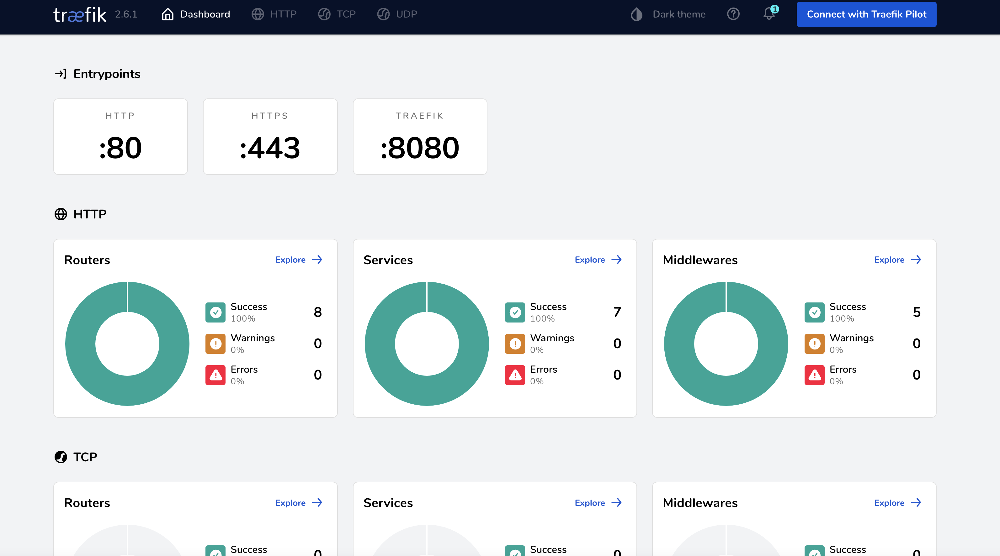

# Traefik 快速上手示例

本项目旨在演示如何快速上手 Traefik：包含服务动态接入、配置证书。
## 如何配置和启动 Traefik

 这个小节将展示如何启动一个最基础的 Traefik 示例，配置具体的内容你并不需要过多了解，建议先跑起来再说 :)
### 第一步：创建容器虚拟网卡

首先使用创建一个 Traefik 和它服务的相关应用使用的网卡，我们约定在这个网卡上的应用，将能够被进行服务发现和自动注册到 traefik 上。

```bash
bash scripts/prepare-network.sh
```

### 第二步：生成必要的证书

接着生成我们所需要的证书，这里有两个选择，第一种使用容器来进行生成：

```bash
docker-compose -f docker-compose.make-cert.yml up
```

第二种则是直接使用命令（需要本地安装 openssl）：

```bash
bash scripts/generate-certs.sh
```

如果你希望生成多个不同的泛解析域名，或者想获得一些复杂的域名 DNS 组合，可以使用这个工具 [certs-maker](https://github.com/soulteary/certs-maker)，它的命令行使用示例：

```bash
docker run --rm -it -e CERT_DNS=a.com\;\*.domain.com\;a.c.com -v `pwd`/certs:/ssl soulteary/certs-maker
```

### 第三步：绑定域名到合适的机器上

如果你是在本地启动 Traefik，可以使用下面的方式，将某个域名绑定到本地。

```bash
echo "127.0.0.1 dashboard.example.com">>/etc/hosts
```

或者使用 DNS 服务器（Homelab 或者公网都可以）指定到某台远程服务器上。

### 第四步：启动 Traefik 应用

接着使用 `docker-compose up -d` 启动服务，稍等片刻，在浏览器中打开刚刚绑定到域名，就能开始你的 Traefik 之旅啦。



当然，因为我们使用的是自签名证书，所以在浏览器中打开网站的时候，会提示安全风险。这里推荐进行自签名证书信任，当然，你也可以选择购买网络服务商的证书，或者使用 Let's Encrypt 签发的证书。（另外一个示例，可以参考这里  https://suyang.wiki/runbook/traefik/issue-certs.html ）

## 如何进行服务动态接入

TBD
## 如何调整服务域名

相信你一定希望能够使用自己的域名来运行服务。

你可以在下面的文件中，将 `example.com` 替换为你想要的域名，然后重启服务就可以了。

- docker-compose.yml
- config/tls.toml（注意保持路径和文件名正确）
- scripts/generate-certs.sh （如果没有使用脚本生成证书，则可以忽略）