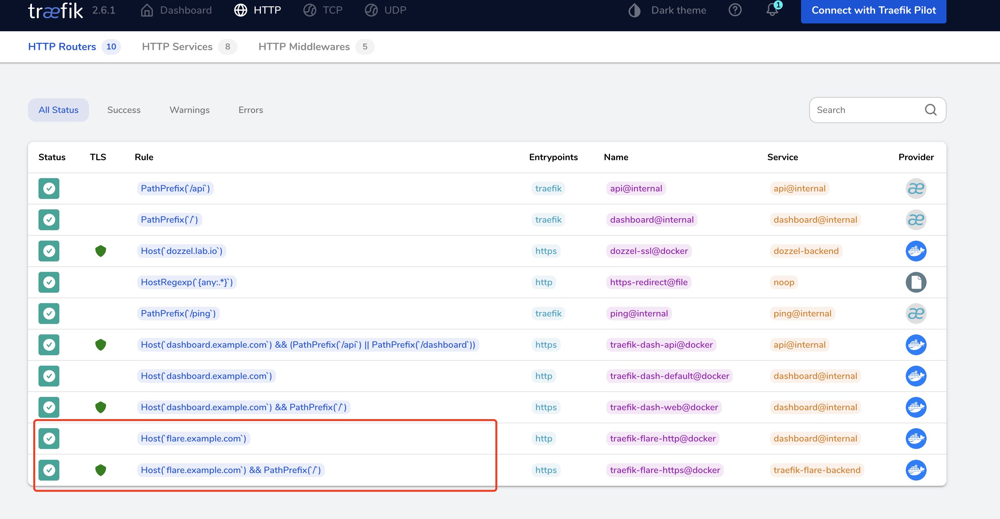

# Traefik 快速上手示例

本项目旨在演示如何快速上手 Traefik：包含服务动态接入、配置证书。
## 如何配置和启动 Traefik

 这个小节将展示如何启动一个最基础的 Traefik 示例，配置具体的内容你并不需要过多了解，建议先跑起来再说 :)
### 第一步：创建容器虚拟网卡

首先使用创建一个 Traefik 和它服务的相关应用使用的网卡，我们约定在这个网卡上的应用，将能够被进行服务发现和自动注册到 traefik 上。

```bash
bash scripts/prepare-network.sh
```

### 第二步：生成必要的证书

接着生成我们所需要的证书，这里有两个选择，第一种使用容器来进行生成：

```bash
docker-compose -f docker-compose.make-cert.yml up
```

第二种则是直接使用命令（需要本地安装 openssl）：

```bash
bash scripts/generate-certs.sh
```

如果你希望生成多个不同的泛解析域名，或者想获得一些复杂的域名 DNS 组合，可以使用这个工具 [certs-maker](https://github.com/soulteary/certs-maker)，它的命令行使用示例：

```bash
docker run --rm -it -e CERT_DNS=a.com\;\*.domain.com\;a.c.com -v `pwd`/certs:/ssl soulteary/certs-maker
```

### 第三步：绑定域名到合适的机器上

如果你是在本地启动 Traefik，可以使用下面的方式，将某个域名绑定到本地。

```bash
echo "127.0.0.1 dashboard.example.com">>/etc/hosts
```

或者使用 DNS 服务器（Homelab 或者公网都可以）指定到某台远程服务器上。

### 第四步：启动 Traefik 应用

接着使用 `docker-compose up -d` 启动服务，稍等片刻，在浏览器中打开刚刚绑定到域名，就能开始你的 Traefik 之旅啦。


当然，因为我们使用的是自签名证书，所以在浏览器中打开网站的时候，会提示安全风险。这里推荐进行自签名证书信任，当然，你也可以选择购买网络服务商的证书，或者使用 Let's Encrypt 签发的证书。（另外一个示例，可以参考这里  https://suyang.wiki/runbook/traefik/issue-certs.html ）

## 如何进行服务动态接入

本小节将介绍如何使用 traefik 动态接入服务。

### 第一步：观察和分析需要接入的应用

这里以另外一个项目 https://github.com/soulteary/docker-flare 为例。

```yml
version: '3.6'

services:
  flare:
    image: soulteary/flare:0.2.5
    restart: always
    # 默认无需添加任何参数，如有特殊需求
    # 可阅读文档 https://github.com/soulteary/docker-flare/blob/main/docs/advanced-startup.md
    command: flare
    ports:
      - 5005:5005
    volumes:
      - ./app:/app
```
如上面的配置展示的一样，flare 默认将使用本地的 5005 端口和容器内的应用 5005 端口打通，提供 HTTP 服务。

我们如果想要看的 flare 的界面，则需要在启动应用后，访问 `localhost:5005`。


### 第二步：改写接入 Traefik 的配置文件

如果想要一个应用接入 Traefik，最简单的方式便是在它原本的配置中作一些调整：

```yml
version: '3.6'

services:
  flare:
    image: soulteary/flare:0.2.5
    restart: always
    # 默认无需添加任何参数，如有特殊需求
    # 可阅读文档 https://github.com/soulteary/docker-flare/blob/main/docs/advanced-startup.md
    command: flare
    labels:
      - "traefik.enable=true"
      - "traefik.docker.network=traefik"

      - "traefik.http.routers.traefik-flare-http.middlewares=https-redirect@file"
      - "traefik.http.routers.traefik-flare-http.entrypoints=http"
      - "traefik.http.routers.traefik-flare-http.rule=Host(`flare.example.com`)"
      - "traefik.http.routers.traefik-flare-http.service=dashboard@internal"

      - "traefik.http.routers.traefik-flare-https.entrypoints=https"
      - "traefik.http.routers.traefik-flare-https.rule=Host(`flare.example.com`) && PathPrefix(`/`)"
      - "traefik.http.routers.traefik-flare-https.tls=true"

      # 这里是一般性习惯，为了便于阅读，如果我们不声明服务端口，则默认会取 expose 的第一个端口，以及使用第一张网卡
      - "traefik.http.services.traefik-flare-backend.loadbalancer.server.scheme=http"
      - "traefik.http.services.traefik-flare-backend.loadbalancer.server.port=5005"
    networks:
      - traefik
    expose:
      - 5005
    # 仅作为示例，无需映射作数据持久化 :) 
    # volumes:
      # - ./app:/app

networks:
  traefik:
    external: true
```

对比第一步中的配置，我们可以看到，在 `labels` 字段中，我们添加了大量描述内容，用于告诉 traefik：

- 这个应用要接入 traefik 的服务网络
- 接入使用的网卡是 traefik 这块网卡
- 这个应用分别使用 HTTP、HTTPS 提供服务，并分别使用 traefik 的 `http`/`https` entrypoints（端口不同，80和443），两种协议下提供服务的域名都是 `flare.example.com`。
- 其中因为 HTTP 配置了自动跳转 HTTPS 服务，所以这个 entrypoint 下对应的转发服务无所谓是什么，这里我象征性的配置了 traefik 的内部服务 `dashboard@internal`。
- 而 HTTPS entrypoint 我们需要声明它使用 `tls`。
- 最后告诉 traefik，我们的应用和 traefik 交互协议是 http，服务端口是 `5005`。

当然，除了做出上面的细粒度声明之外，我们还需要将他们放到一个网络里：

```yaml
networks:
  - traefik
```
### 第三步：绑定服务域名和启动服务

和上面使用 traefik 一样，我们将 `flare.example.com` 的 DNS 指向绑定到合适的机器上。

然后使用 `docker-compose -f docker-compose.flare.yml up -d` 启动服务。

### 第四步：访问服务

接着我们在浏览器中访问：`http://flare.example.com` ，会发现浏览器自动跳转到了 `https://flare.example.com`（当然，别忘记使用更合适的证书，或者信任自签名证书，避开烦人的安全提示）。

到此为止，我们就已经成功的在不了原理的情况下，掌握了 Traefik 最基础的使用啦。相比较 Nginx，是不是更灵活和简单呢？

或许你会好奇，在 flare 运行起来之后，traefik 会有什么变化吗？



重新访问我们的 traefik dashboard (https://dashboard.exmaple.com) ，你会发现在路由和服务等页面，多出现了几条刚刚我们在上面“第一步操作”时编写的规则。这些规则其实非常灵活、以及和软件的生命周期息息相关，如果你足够熟悉的话，你可以使用 traefik 快速搭建一套完整的 CI/CD 流水线，或者使用 traefik 做一套简单的 WAF、以及一套简单的 Serverless 平台工具。

## 如何调整服务域名

相信你一定希望能够使用自己的域名来运行服务。

你可以在下面的文件中，将 `example.com` 替换为你想要的域名，然后重启服务就可以了。

- docker-compose.yml
- config/tls.toml（注意保持路径和文件名正确）
- scripts/generate-certs.sh （如果没有使用脚本生成证书，则可以忽略）